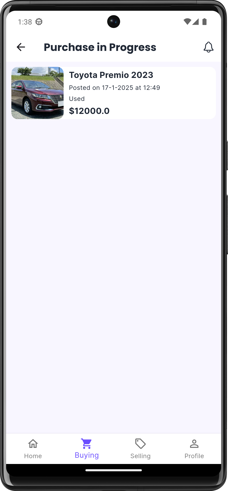
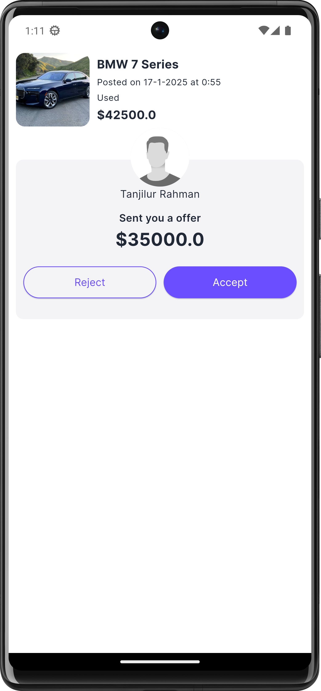

# Conectly 🔗


A modern Flutter-based Consumer-to-Consumer app with MVVM architecture. Features real-time product posting, selling, and a price offer system. Built using Firebase for backend services, Riverpod for state management, and Cloudinary for image hosting.

## 📱 Screenshots

<p align="center"> 
  
  
  
  
  
  
  
  
</p>

## 🚀 Key Features

- **User Authentication**
    - Secure login and signup using **Firebase Authentication**.
    - Support for email/password authentication.

- **Real-Time Updates**
    - Data synced in real-time using **Firebase Firestore**, ensuring users see the latest listings and updates.

- **C2C Trading Platform**
    - Facilitates seamless connections between customers for buying, selling, or exchanging goods and services.

- **Price Offering System**
    - Enables buyers and sellers to negotiate prices within the app, promoting better deals.

- **Image Hosting with Cloudinary**
    - High-quality image uploads and hosting with **Cloudinary** integration.
    - Fast and reliable media delivery.

- **State Management with Riverpod**
    - Efficient and scalable state management for improved app performance.

- **Responsive UI Design**
    - A user-friendly and responsive interface for a seamless experience across devices.

- **Product Listings and Details**
    - View and search for products with detailed information and images.

- **User Profile Management**
    - Users can create and update their profiles, including contact details, profile picture and preferences.

- **Customizable Categories**
    - Browse listings by categories to simplify the user experience.

- **Search and Filters**
    - Advanced search and filtering options to quickly find relevant products or services.

- **Dark Mode**
    - Support for both light and dark themes for better usability.


## 🏗️ Architecture

This project implements the MVVM (Model-View-ViewModel) architecture pattern for clean separation of concerns:

```
lib/
├── models/         # Data models and entities
├── views/          # UI components and screens
│   └── widgets/    # Reusable UI components
├── view_models/    # Business logic and state management
├── services/       # API and external services
└── themes/         # Theme definitions
```

## 🛠️ Technology Stack

- **Flutter 3.x**: Modern UI framework for cross-platform development
- **Riverpod**: Robust state management solution
- **Firebase**: Backend services for authentication, real-time data, and storage
- **Cloudinary**: Image hosting and delivery
- **Google Fonts**: Premium typography
- **HTTP**: Efficient network communication

## 🚀 Getting Started

1. **Clone the repository**
```bash
git clone https://github.com/zsifat/connectly.git
```

2. **Install dependencies**
```bash
flutter pub get
```

3. **Run the application**
```bash
flutter run
```

## 🤝 Contributing

Contributions are welcome! Feel free to:

- Report bugs
- Suggest new features
- Submit pull requests

## 📄 License

This project is licensed under the MIT License - see the [LICENSE](LICENSE) file for details.


## 👨‍💻 Developer

**Zahid**
- GitHub: [@zsifat](https://github.com/zsifat)
- LinkedIn: [@zahidulislam](https://www.linkedin.com/in/zahidulislam1/)

## 🌟 Show your support

Give a ⭐️ if you like this project!

---

<p align="center">Made with ❤️ by Zahid</p>
